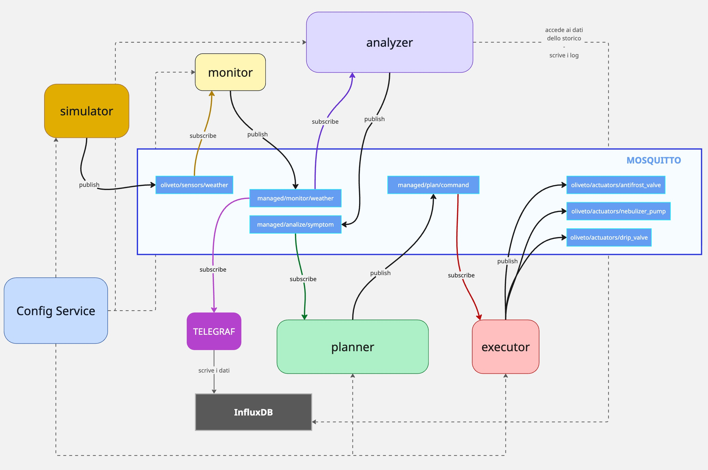

# Smart Olive Grove Manager (SOGM)

**Student:** Marco Spada (ID: 308887)  
**Course:** Software Engineering for Autonomous Systems

## Project Overview

This project implements an advanced Autonomic Computing System for managing an olive grove using the MAPE-K loop architecture.

Unlike traditional static implementations, this system features a **Dynamic, Data-Driven Architecture**. The logic is not hardcoded in the microservices; instead, the system acts as a **generic Control Platform** where sensors, actuators, and control loops are defined via an external configuration. This approach demonstrates key software engineering principles such as **Decoupling, Heterarchical Control, and Resilience**.

## 🏗️ Architecture: The "External Approach"

The system is fully containerized (Docker) and composed of the following services:

### 1. Infrastructure Layer
- **Mosquitto (MQTT):** The message bus for asynchronous communication.
- **InfluxDB:** Time-series database for historical knowledge and trend analysis.
- **Grafana:** Visualization dashboard.

### 2. Managed Resource (Digital Twin)
- **Simulator (Containerized):** A Node.js service that simulates the physical environment (Weather, Soil, Pests) and the physical actuators. It is agnostic: it downloads its definition (which sensors to simulate) from the Config Service at startup.

### 3. Autonomic Manager (The Brain)
Decomposed into independent microservices:

- **Config Service (Source of Truth):** Provides the system topology (devices) and Control Policies (Loops) via HTTP.
- **Monitor:** Dynamically subscribes to sensor topics defined in the configuration.
- **Analyzer (Generic Engine):** Evaluates logical rules (AND/OR, Thresholds) and complex historical queries (e.g., `EXT_INFLUX_DELAY`, `EXT_TEMP_DROP_RATE`) defined in the JSON configuration.
- **Planner (Conflict Resolver):** Receives action requests and resolves conflicts between loops based on **Numerical Priority** (e.g., Safety > Production).
- **Executor:** Maps logical commands to specific physical topics.

## 🚀 Key Engineering Concepts Implemented

- **Single Source of Truth:** All rules, thresholds, and topology are centralized in `config-service`. Changing a threshold requires **zero code changes** in the Analyzer.
- **Decoupling & Portability:** All services are independent containers. The Simulator runs in Docker, making the project runnable on any machine with one command.
- **Dynamic Control Loops (Heterarchy):** The system supports "Many-to-Many" relationships. One sensor can trigger multiple actuators, or multiple sensors can influence a single decision.
- **Fault Tolerance (Retry Pattern):** Services implement a robust startup sequence, retrying connections indefinitely until dependencies (like Config Service) are healthy.

## 🛠️ How to Run the System

### Prerequisites
- **Docker Desktop** installed and running.

### Start Everything
Open a terminal in the project root and run:

```bash
docker-compose up --build
```

That's it. No need to install Node.js locally or run separate terminals. The command will build all images, start the infrastructure, and launch the autonomic loop.

### Verify System Behavior

Check the logs to see the loop in action:

```bash
# View the Analyzer evaluating rules dynamically
docker logs -f sogm_analyzer

# View the Planner resolving conflicts based on priority
docker logs -f sogm_planner
```

## 🧪 How to Test Specific Scenarios
To verify the autonomic logic, you can modify the initial physics state in managed-resource/simulator.ts and restart only the simulator container.

### Scenario A: Hydration Maintenance (Reactive)
**Goal:** Detect low humidity (< 30%) and activate the Drip Valve.

1. Open **`managed-resource/simulator.ts.`**
2. Modify the physics object:

```TypeScript
let physics = {
  temperature: 25.0,
  humidity: 20.0,    // <--- TEST: Below threshold (30%)
  wind_speed: 5.0,
  trap_count: 0
};
```
Apply changes: 
```bash
docker-compose up -d --build simulator
```

Result: 
```bash 
Log shows 🚀 [EXECUTOR] ON -> .../drip_valve.
```


### Scenario B: Pest Control with Conflict Resolution
**Goal:** Treat infestation (`> 50 pests`) ONLY if wind is safe (`< 15 km/h`). If wind is high, wait. `If delay > 30 mins`, force activation.

Open **`managed-resource/simulator.ts.`**

Modify the physics object:

```TypeScript
let physics = {
  temperature: 20.0,
  humidity: 50.0,
  wind_speed: 25.0,  // <--- TEST: High Wind (> 15)
  trap_count: 80     // <--- TEST: Critical Infestation (> 50)
};
```
Apply changes: 
```bash
docker-compose up -d --build simulator
```

Result:
```bash
Analyzer logs: ℹ️ Primo blocco vento rilevato. Avvio timer...
```

Actuator remains OFF initially.

(After 30 mins or forcing DB): Analyzer logs 📝 Timer avviato and eventually activates override.


### Scenario C: Frost Protection (Predictive/Critical)
**Goal:** Immediate activation of anti-frost emitter if temperature drops below 0°C.

Open **`managed-resource/simulator.ts.`**

Modify the physics object:

```TypeScript
let physics = {
  temperature: -2.0, // <--- TEST: Freezing condition
  humidity: 40.0,
  wind_speed: 5.0,
  trap_count: 0
};
```
Apply changes: 
```bash
docker-compose up -d --build simulator
```

Result: 
```bash
Analyzer logs ⚡ Loop Critico 'loop_frost_protection' attivato! and Executor sends ON to antifrost_emitter.
```

## ⚙️ Configuration & Logic (The Core)
The system behavior is defined in **`config-service/index.ts`**. Here are the active Control Loops:

### 1. Hydration Protection (Priority: 1)
**Logic:** Simple Threshold  
**Rule:** IF `humidity < 30` THEN `drip_valve = ON`

### 2. Smart Pest Control (Priority: 5)
**Logic:** Complex Boolean Logic + Historical Data  
**Rule:** IF `trap_count > 50` AND (`wind_speed < 15` OR `EXT_INFLUX_DELAY > 30 mins`)  
**Description:** Normally, we don’t spray pesticides if wind is high. However, if the high wind persists for more than 30 minutes (checked via InfluxDB), the system overrides the safety constraint and sprays anyway.

### 3. Storm Safety (Priority: 10 - Critical)
**Logic:** Safety Override  
**Rule:** IF `wind_speed > 40` THEN `drip_valve = OFF` AND `nebulizer_pump = OFF`  
**Conflict Resolution:** Since Priority 10 is higher than 1 and 5, this loop wins against Hydration and Pest Control, forcing a shutdown.

### 4. Frost Protection (Priority: 8)
**Logic:** Critical Threshold  
**Rule:** IF `temperature <= 0` THEN `antifrost_emitter = ON`

## 📊 Visualization
Open http://localhost:3000 (User/Pass: admin/admin).

Go to Explore → Select influxdb_smart_olive_grove.

You can plot wind_speed, trap_count, and nebulizer status to verify the logic.

```bash
📂 Project Structure
├── config-service/   # Stores Topology and Rules (JSON)
├── analyzer/         # Generic Rule Engine
├── planner/          # Priority-based Decision Maker
├── monitor/          # Data Collector
├── executor/         # Actuator Commander
├── managed-resource/ # Agnostic Simulator
├── mosquitto/        # MQTT Config
└── docker-compose.yml
```

## Architecture Schema

